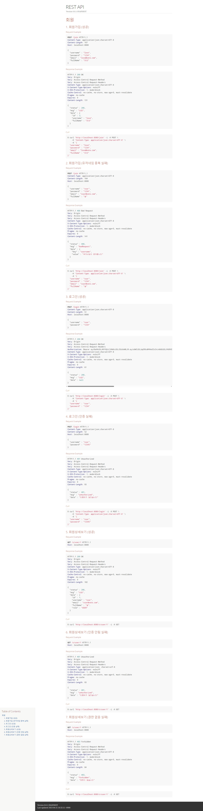

# 스프링부트 CSR RestAPI With Security, JWT, JPA 총정리

## 1. API 문서


## 2. 사용기술
- Springboot 2.7
- H2, JPA
- Security Stateless 설정
- JWT 설정
- AOP 설정
  - 참고 : https://github.com/codingspecialist/Springboot-AOP
  - DebugLog
  - ErrorLog
  - Validation
  - Exception
- 정규표현식
  - 참고 : https://github.com/codingspecialist/Springboot-MetaMall-Project/blob/complete/src/test/java/shop/mtcoding/metamall/regex/RegexTest.java
- Filter 설정
- Interceptor 설정
- CORS 설정
- WebMvcConfigure 설정 (Resource Handler)
- Junit 통합테스트 및 RestDoc 문서 자동화
- Junit 단위테스트 
  - WebMvcTest(Controller)
  - MockitoExtension(Service)
  - DataJpaTest(Repository)
- 배포 yml Profile 설정
  - CI/CD 배포 방법 : https://github.com/codingspecialist/Aws-Deploy-EasyupClass
  - 책 : http://www.yes24.com/Product/Goods/117628175
- SSR Blog 프로젝트 (JPA, Security)
  - 참고 : https://github.com/codingspecialist/Springboot-SSR-Blog-Project
- OAuth2.0 로그인
  - 참고 : https://github.com/codingspecialist/Springboot-OAuth-Kakao-Login
- Security에 OAuth2.0 추가하는 법
  - https://github.com/codingspecialist/-Springboot-Security-OAuth2.0-V3
  - https://github.com/codingspecialist/Springboot-JWT-React-OAuth2.0-Eazy
  - https://github.com/codingspecialist/Springboot-Oauth2.0-Facebook-Google-Login-JWT
  - https://github.com/codingspecialist/Springboot-Oauth2.0-Facebook-Google-Login-Session


## 3. QLRM
DTO로 DB에서 조회해서 받아야 한다면, QLRM 라이브러리를 사용하고, 직접 @Repository를 생성하자.
```txt
    Query query = em.createNativeQuery(sql);
    JpaResultMapper result = new JpaResultMapper();
    AllOutDTO dto = result.uniqueResult(query, AllOutDTO.class);
```

## 4. Hibernate 전략
- OSIV = false
- 모든 것들은 Lazy 전략
- 서비스단에서 응답 DTO 생성
- OneToMany 사용안하기
- findAll은 fetch join 사용하기
- 복잡한 연관관계 데이터를 응답할 때는 여러번 select 해서 DTO에 담아서 조합하기
- 모든 작업이 끝나고, 한방쿼리로 튜닝할 것들이 있으면 튜닝하기

## 5. Mock 테스트 어노테이션 정리
```txt
Mock: 실제 객체를 추상화된 가짜 객체로 만들어 테스트에 사용합니다. Mockito 환경에 주입합니다.
InjectMocks: Mock 객체들을 사용하여 진짜 객체를 생성하고, 해당 객체를 테스트 대상 코드에 주입합니다.
MockBean: 스프링의 IoC 컨테이너에 Mock 객체를 주입합니다.
Spy: 실제 객체를 만들어 Mockito 환경에 주입하고, 해당 객체의 일부 메서드만 가짜 구현으로 대체하여 테스트합니다.
SpyBean: 스프링의 IoC 컨테이너에 Spy 객체를 주입합니다.
Mockito와 Spring의 차이점을 요약하자면, Mockito는 단위 테스트를 위한 라이브러리이며, 
Spring은 애플리케이션 개발을 위한 프레임워크입니다. 
Mockito는 단위 테스트에서 사용할 가짜 객체를 생성하고, 주입하는 기능을 제공하고, 
Spring은 IoC 컨테이너를 통해 애플리케이션 개발에 필요한 객체들을 생성하고 관리합니다.
```

## 6. API 문서 만들기
https://github.com/codingspecialist/Springboot-Gradle-RestDoc

## 7. 문서 보는법
http://localhost:8080/docs/api-docs.html